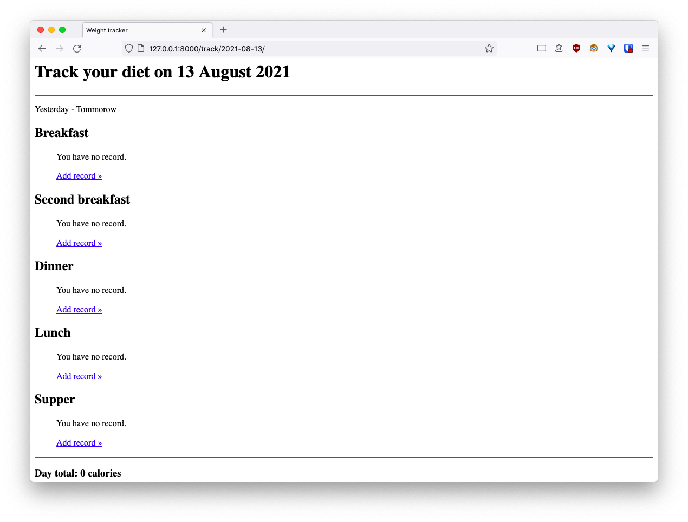
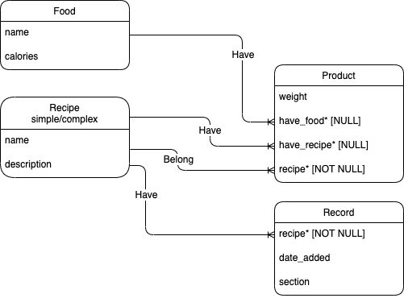

# Weight/food traker/webapp

> This project is still in development!

## Features

- [x] Clean up code + style app & forms
- [x] Fix formsets create/update
- [ ] Validate product model

## Data model

Models:

1. Food - abstract food. Food object always has a alias recipe (for choosing).
2. Recipe - combination of products.
3. Product - food or recipe with weight. Product is always bind to some recipe.

## API

- `/edit/` - edit recipe (which is food or recipe).